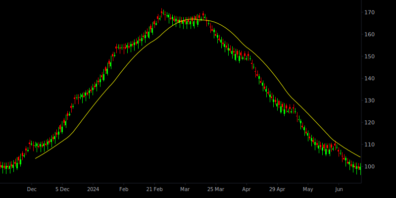
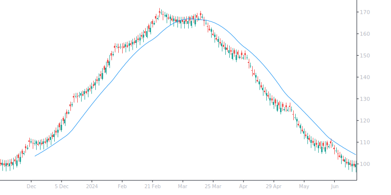
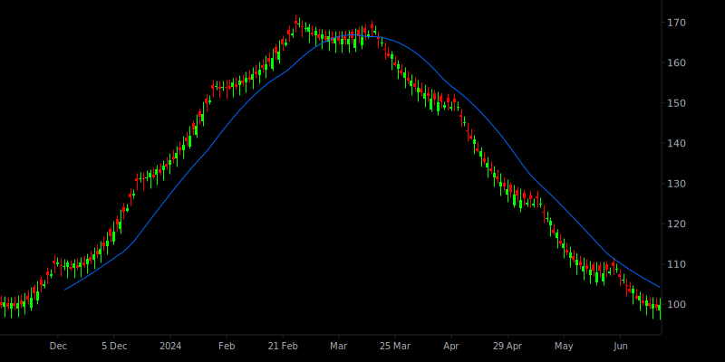
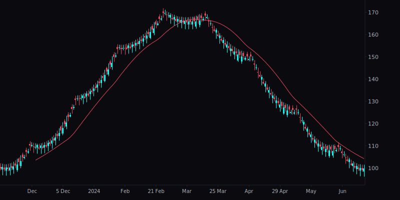
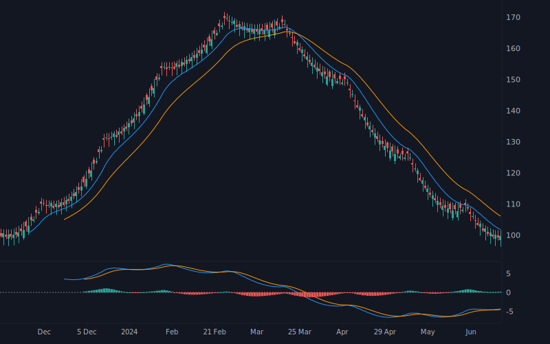
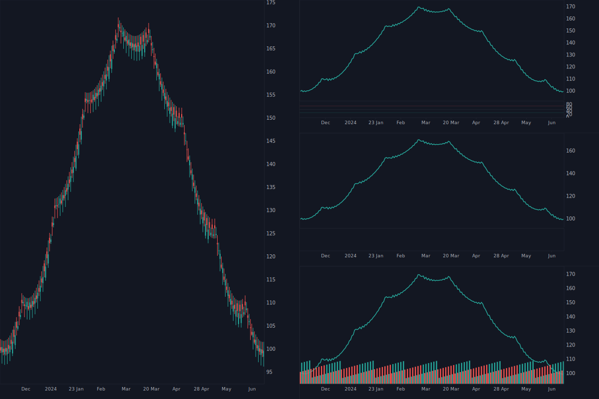
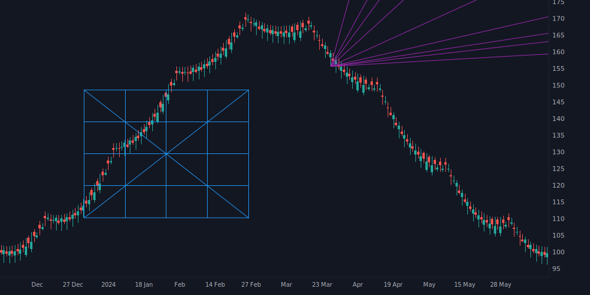
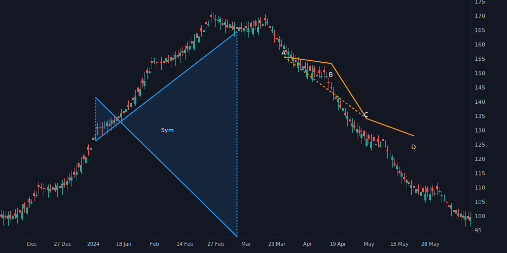

# zengeld-canvas

**High-performance SVG chart rendering engine for financial data visualization**

[](https://crates.io/crates/zengeld-canvas)
[](https://pypi.org/project/zengeld-canvas/)
[](https://www.npmjs.com/package/zengeld-canvas)

A platform-agnostic rendering library for financial charts. Built in Rust with zero runtime dependencies, available for Rust, Python, and JavaScript.

## Installation

| Platform | Package | Install |
|----------|---------|---------|
| Rust | [crates.io](https://crates.io/crates/zengeld-canvas) | `cargo add zengeld-canvas` |
| Python | [PyPI](https://pypi.org/project/zengeld-canvas/) | `pip install zengeld-canvas` |
| JavaScript | [npm](https://www.npmjs.com/package/zengeld-canvas) | `npm install zengeld-canvas` |

## Examples

<table>
  <tr>
    <td align="center"><br/><b>Dark Theme</b></td>
    <td align="center"><br/><b>Light Theme</b></td>
  </tr>
  <tr>
    <td align="center"><br/><b>High Contrast Theme</b></td>
    <td align="center"><br/><b>Cyberpunk Theme</b></td>
  </tr>
  <tr>
    <td align="center"><br/><b>MACD Indicator</b></td>
    <td align="center"><br/><b>Multi-Chart Layout</b></td>
  </tr>
  <tr>
    <td align="center"><br/><b>Gann Tools</b></td>
    <td align="center"><br/><b>Chart Patterns</b></td>
  </tr>
</table>

## Features

- **96 Drawing Primitives** - Fibonacci, Gann, Pitchforks, Elliott Waves, Patterns, Channels, and more
- **45+ Indicator Presets** - Pre-configured rendering styles for SMA, RSI, MACD, Bollinger, Ichimoku, etc.
- **12 Series Types** - Candlestick, HeikinAshi, Line, Area, Histogram, Baseline, and more
- **14 Multi-Chart Layouts** - Grid, split, and custom layouts for dashboards
- **Platform Agnostic** - `RenderContext` trait for any rendering backend
- **Zero Dependencies** - Only serde for serialization
- **High Performance** - Optimized for real-time chart rendering
- **Theme System** - 4 built-in presets (dark, light, high_contrast, cyberpunk) + runtime customization

## Drawing Primitives

| Category | Count | Examples |
|----------|-------|----------|
| Fibonacci | 11 | Retracement, Fan, Arcs, Circles, Channel, Spiral |
| Lines | 9 | TrendLine, HorizontalLine, Ray, ExtendedLine |
| Annotations | 11 | Text, Callout, PriceLabel, Flag, Table |
| Shapes | 10 | Rectangle, Circle, Ellipse, Triangle, Path |
| Elliott Waves | 5 | Impulse, Correction, Triangle, Combo |
| Patterns | 6 | XABCD, HeadShoulders, Cypher, ThreeDrives |
| Gann | 4 | Fan, Box, Square, SquareFixed |
| Channels | 4 | Parallel, Regression, Disjoint, FlatTopBottom |
| Pitchforks | 4 | Standard, Schiff, Modified, Inside |
| And more... | 32 | Cycles, Projections, Volume, Arrows, Events |

## Indicator Rendering Presets

Pre-configured styles for common technical indicators (you provide the data, we render it):

**Moving Averages:** SMA, EMA, WMA, HMA, DEMA, TEMA, KAMA, ZLEMA

**Momentum:** RSI, Stochastic, MACD, CCI, Williams %R, ROC, TSI, Awesome Oscillator

**Volatility:** Bollinger Bands, Keltner Channel, Donchian, ATR, Envelopes

**Volume:** OBV, A/D Line, CMF, Chaikin Oscillator, Force Index

**Trend:** ADX, Aroon, Vortex, Supertrend, ZigZag, Parabolic SAR, Ichimoku

## Theme System

Built-in theme presets with full customization support:

| Preset | Description |
|--------|-------------|
| `dark` | Dark background with green/red candles (default) |
| `light` | Light background for printing and bright environments |
| `high_contrast` | Maximum contrast for accessibility |
| `cyberpunk` | Neon colors on dark purple background |

Themes can be customized at runtime via `RuntimeTheme` with JSON serialization support.

## Quick Start

### Rust

```rust
use zengeld_canvas::{Chart, Bar, UITheme};

// Create chart with builder API
let svg = Chart::new(800, 600)
    .bars(&bars)
    .candlesticks()
    .sma(20, "#2196F3")
    .rsi(14)
    .render_svg();

// With theme
let theme = UITheme::light();
let svg = Chart::new(800, 600)
    .bars(&bars)
    .candlesticks()
    .background(theme.colors.chart.background)
    .colors(theme.colors.series.candle_up_body, theme.colors.series.candle_down_body)
    .render_svg();
```

### Python

```python
from zengeld_canvas import Chart, Bar, UITheme

# Build chart
chart = Chart(800, 600)
chart.bars(bars)
chart.candlesticks()
chart.sma(20, "#2196F3")
svg = chart.render_svg()

# With theme
theme = UITheme.light()
chart = Chart(800, 600)
chart.bars(bars)
chart.candlesticks()
chart.background(theme.background)
chart.colors(theme.candle_up_body, theme.candle_down_body)
svg = chart.render_svg()
```

### JavaScript

```javascript
import init, { Chart, JsBar, JsUITheme } from 'zengeld-canvas';

await init();

// Create chart
const chart = new Chart(800, 600);
chart.setBars(bars);
chart.candlesticks();
chart.sma(20, "#2196F3");
const svg = chart.renderSvg();

// With theme
const theme = JsUITheme.light();
const chart2 = new Chart(800, 600);
chart2.setBars(bars);
chart2.candlesticks();
chart2.background(theme.background);
chart2.colors(theme.candle_up_body, theme.candle_down_body);
const svg2 = chart2.renderSvg();
```

## License

MIT OR Apache-2.0

## Support the Project

If you find this library useful, consider supporting development:

| Currency | Network | Address |
|----------|---------|---------|
| USDT | TRC20 | `TNxMKsvVLYViQ5X5sgCYmkzH4qjhhh5U7X` |
| USDC | Arbitrum | `0xEF3B94Fe845E21371b4C4C5F2032E1f23A13Aa6e` |
| ETH | Ethereum | `0xEF3B94Fe845E21371b4C4C5F2032E1f23A13Aa6e` |
| BTC | Bitcoin | `bc1qjgzthxja8umt5tvrp5tfcf9zeepmhn0f6mnt40` |
| SOL | Solana | `DZJjmH8Cs5wEafz5Ua86wBBkurSA4xdWXa3LWnBUR94c` |

---

<p align="center">
  <a href="https://zen-geldmaschine.net/">
    
  </a>
</p>
